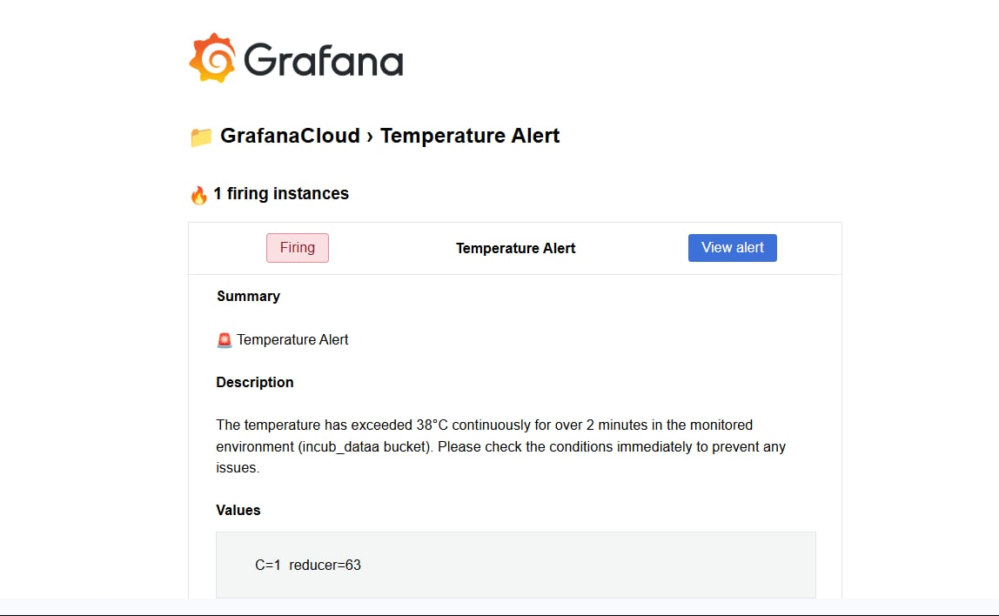

# Smart Incubator with IoT Integration

A FreeRTOS-based smart incubator system built with STM32 (NUCLEO-F401RE), integrated with IoT functionality via ESP32. It enables real-time environmental control, cloud monitoring, and data visualization using InfluxDB and Grafana.

---

## 🚀 Overview

This project is a complete embedded + IoT solution for automated incubation. It includes:

* Sensor-based environmental monitoring
* Actuator control for temperature and humidity regulation
* Real-time multitasking using FreeRTOS
* UART communication with ESP32
* Cloud dashboard with alerts and historical data

---

## ⚙️ Hardware Components

| Component                          | Role                                 |
| ---------------------------------- | ------------------------------------ |
| STM32 NUCLEO-F401RE                | Main controller running FreeRTOS     |
| ESP32-WROOM-32D                    | Wi-Fi module for cloud communication |
| DHT11                              | Temperature and humidity sensor      |
| Stepper Motor (28BYJ-48 + ULN2003) | Ventilation door control             |
| Limit Switches                     | Stepper motor boundary detection     |
| Relay Modules (x2)                 | Fan and light bulb control           |
| LEDs (x3)                          | Status indicators                    |
| 16x2 I2C LCD                       | User display interface               |

---

## 🧠 Embedded Firmware (STM32)

Implemented using STM32CubeIDE + FreeRTOS.

### 🧩 Key Features

* **FreeRTOS Tasks:**

  * `SensorCommTask`: DHT11 reading + UART TX to ESP32
  * `StepperTask`: Humidity-based door control
  * `FanTask` & `BulbTask`: Relay toggling based on thresholds
  * `LEDTask`: Visual humidity feedback
  * `DisplayTask`: Cycles through 5 LCD views

* **Sensor Management:**

  * Maintains real-time humidity & temperature
  * Tracks min/max values over time

* **Actuator Logic:**

  * Door opens/closes depending on deviation from humidity midpoint
  * Fan ON/OFF cycles tuned to humidity level
  * Bulb toggled based on Fahrenheit thresholds

* **Data Sync to ESP32:**

  * Every 5 seconds, a string like this is sent:

    ```
    T:95.3F H:54.2% Tmin:93.0 Tmax:98.5 Hmin:50.0 Hmax:56.5 Uptime:00:02:31:14 Door:Idle
    ```

---

## ☁️ Cloud Dashboard (ESP32 + InfluxDB + Grafana)

### 📡 ESP32 Firmware

* Receives STM32 string over UART2
* Parses values via `sscanf()`
* Sends HTTP POST to InfluxDB using line protocol
* Sample payload:

  ```
  environment,sensor=stm32 temperature=35.5,humidity=55.2,... uptime="00:02:10:03",door_state="Opening"
  ```

### 📊 Grafana Dashboard

* **Gauges** for temperature and humidity
* **Time-series graphs** for trends
* **Text panel** showing door state and uptime
* **Alerts**:

  * Temp > 38°C → overheating alert
  * Humidity > 70% → condensation warning

---

## 📸 Results & Demonstration

The incubator was fully assembled, programmed, and tested. Below are key outputs from the project:

### 🛠️ **Functional Prototype**  
  
*Physical prototype showing the assembled incubator with electronics, sensors, and egg tray.*  

---

### ✅ **Circuit Wiring**  
  
*Full electrical connections: STM32, relays, LCD, fan, and ESP32.*  

---

### 🐣 **Egg Hatching Video**  
<div align="center">
  <a href="https://youtu.be/8fVwQ87gc_k" target="_blank">
    
  </a>
  <br>
  <a href="https://youtu.be/8fVwQ87gc_k" target="_blank">Watch Full Video</a>
</div>

---

### 📊 **Grafana Dashboard**  
  
*Live monitoring of temperature, humidity, and system uptime.*  

---

### 📬 **Email Alert Example**  
  
*Automated alert triggered by abnormal conditions.* 

---

###📎 **Complete Report Available**: All implementation steps, hardware schematics, software design, FreeRTOS task analysis, and cloud integration are fully documented in `incubator_pdf.pdf`.

---

## 👤 Author

**Ghaith Ben Brahim**
Embedded Software Engineering Student
GitHub: [@GhaithhBenbrahim](https://github.com/GhaithhBenbrahim)

---

## 🏁 Final Notes

This project bridges low-level real-time embedded control with modern cloud-based IoT dashboards. Designed for educational and demonstrative purposes, it's modular, scalable, and can serve as a template for any sensor-actuator-cloud IoT system.
